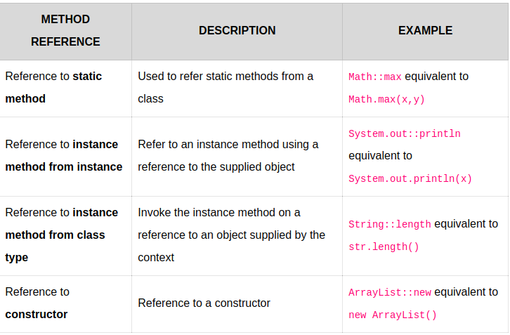

# Lambda Expression

## What is Lambda Expression

Anonymous function, i.e., a function with no name and without being bounded to an identifier

```java
either
(parameters) -> expression
or
(parameters) -> { statements; }
or
() -> expression
```

Example Lambda

```java
(x, y) -> x + y  
//This function takes two parameters and return their sum.
```

### Rules for writing lambda expressions

1. A lambda expression can have zero, one or more parameters.
2. The type of the parameters can be explicitly declared or it can be inferred from the context.
3. Multiple parameters are enclosed in mandatory parentheses and separated by commas. Empty parentheses are used to represent an empty set of parameters
4. When there is a single parameter, if its type is inferred, it is not mandatory to use parentheses. e.g. a -> return a*a.
5. The body of the lambda expressions can contain zero, one or more statements.
6. If body of lambda expression has single statement curly brackets are not mandatory and the return type of the anonymous function is the same as that of the body expression. When there is more than one statement in body than these must be enclosed in curly brackets.

## Functional Interface

1. Single Abstract Method interfaces (SAM Interfaces) i.e. interfaces with only one single method
2. In Java 8 they are also referred as Functional Interfaces.
3. Java 8 enforces this rule of single responsibility (method) by annotating them with `@FunctionalInterface`
4. If we try to add more than one method to it, compiler will throw an exception.

For Example

```java
@FunctionalInterface
public interface Runnable {
    public abstract void run();
}
```

## How Functional Interfaces are related to Lambda expressions

We know that, in java method parameters always have a type and this type information is used to determine which method to call in case of method overloading or even in case of single method calls.

We also know that lambda expressions are mostly passed to methods as parameters.

So lambda expressions must also be represented by some type so that we can pass them to a method.

This type is always of functional interface type.

**In simple words, a lambda expression is an instance of a functional interface. But a lambda expression itself does not contain the information about which functional interface it is implementing; that information is deduced from the context in which it is used.**

## Types of Method References – Quick Overview



Image courtesy https://howtodoinjava.com

